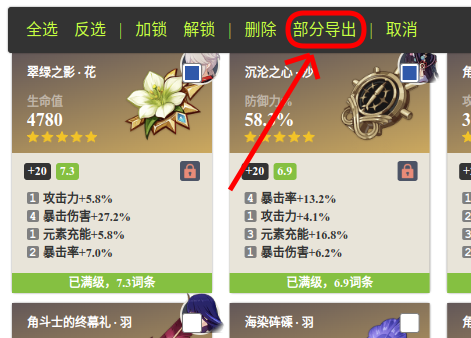
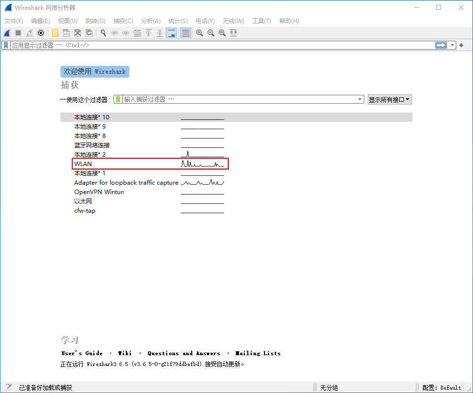
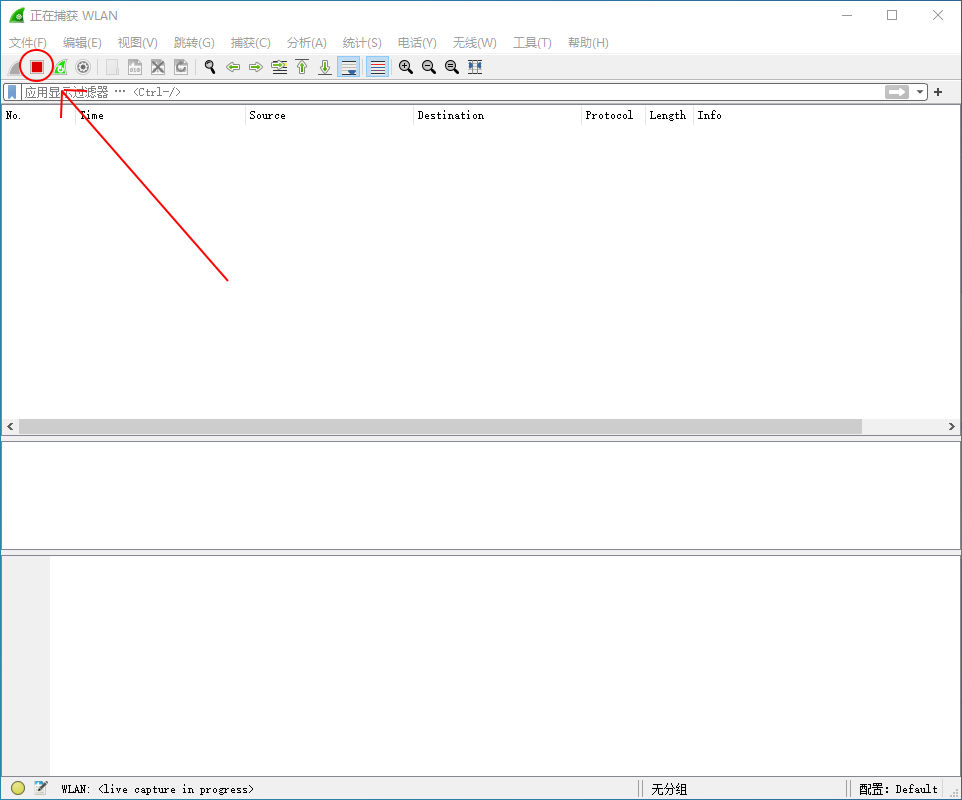
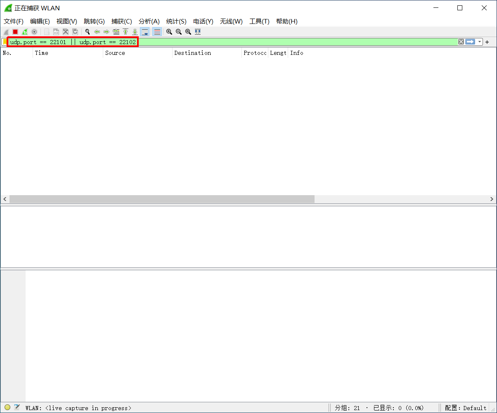
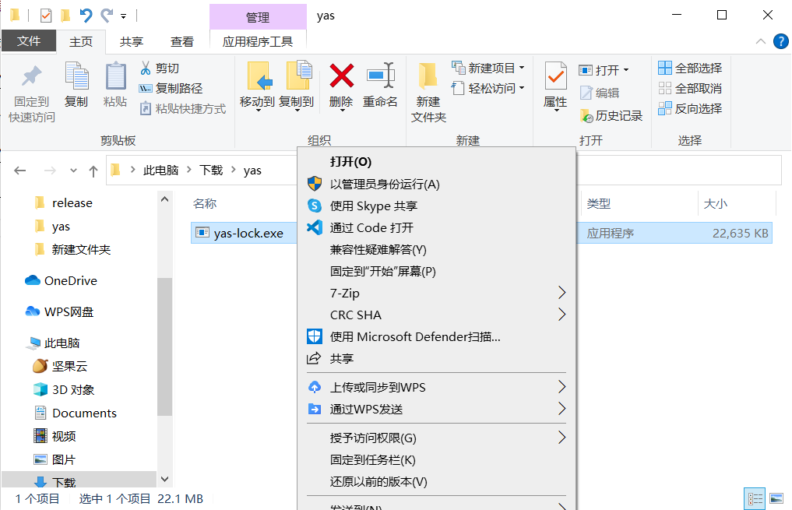

[TOC]

> 自2.8起，米哈游加强了数据包加密，暂不支持抓包及pcap文件的解析

# 0. 关于

圣遗物强化助手专注于辅助玩家强化圣遗物。通过本助手及相关工具，你可以：

 👁️‍🗨️ 快速导出游戏内的圣遗物数据：
 - ~~通过抓包（使用自带tcpdump或安装wireshark，推荐）~~
 - 通过OCR（需安装yas/天目/yas-lock等）

🔀 更便捷地对圣遗物进行筛选、排序、修改（在浏览器中完成）

🔒 快速修改游戏内圣遗物的加解锁状态（需安装yas-lock）


反馈：[NGA分享贴](https://bbs.nga.cn/read.php?tid=29551863) | [Issue](https://github.com/fungusovo/artifact/issues) （都是小号，不经常看）

# 1. 圣遗物导出

<!--
有抓包和OCR两种方法。

## 1.1 抓包

通过tcpdump或wireshark抓包，导入pcap文件到圣遗物强化助手。

你需要有一台电脑运行抓包工具，

- 在同一台电脑上运行原神客户端，或
- 在用来抓包的电脑上打开WiFi热点，用另一台设备（例如手机）连接热点并运行原神客户端。

抓包工具：

- tcpdump: MacOS和Linux自带，命令行工具，有一定使用门槛
- wireshark: 全平台可用，需下载安装，傻瓜式操作

注意事项：

- 先打开抓包工具，再打开原神（如果原神正在运行，先关闭它）
- 按正常流程登录游戏，在进入大门并读条到一格以上后中止抓包
- 以pcap格式导出抓包数据，再导入到圣遗物强化助手即可
- pcap文件太大（推荐10MB以下）可能无法导入圣遗物强化助手，要么过滤端口，要么抓包时间不要太长
- pcap文件**不要传给别人**，圣遗物强化助手不会收集pcap数据，你可以打开开发者工具检查网络请求

成功导入pcap到圣遗物强化助手后，可以再从圣遗物强化助手导出数据为莫娜占卜铺/原魔计算器/Genshin Optimizer等格式。注意不是圣遗物强化助手控制面板的导出，而是进入多选模式后弹出的**部分导出**。



以下介绍tcpdump和wireshark的操作流程。

### 1.1.1 Tcpdump

MacOS和Linux自带无需下载，Windows需要下载而且比较麻烦。

> 需要管理员权限

首先用ifconfig/ip等工具检查电脑上网的接口，一般是en0/eth1/wlo1之类的。

在终端执行
```sh
sudo tcpdump -i [这里替换成接口名，例如en0] udp port 22101 or udp port 22102 -w [这里替换成导出文件的地址，例如~/Desktops/test.pcap]
```

例子：

```sh
sudo tcpdump -i wlo1 udp port 22101 or udp port 22102 -w test.pcap
```

### 1.1.2 Wireshark

全平台可用，需下载安装，傻瓜式操作。以下以Windows系统为例。

从[官网](https://www.wireshark.org/#download)或[百度网盘（暂时没有）]()下载安装包。

安装，一路默认即可。

**视频教程：**

<iframe src="//player.bilibili.com/player.html?aid=384971148&bvid=BV1hZ4y1q78V&cid=743695978&page=1&high_quality=1&danmaku=0" width="100%" height="500" scrolling="no" border="0" frameborder="no" framespacing="0" allowfullscreen="true"> </iframe>

**图文教程：**

打开Wireshark，双击你要监听的接口开始抓包（我这里是WLAN，正常上网的接口后面会有波形图）。



左上红色方块，说明正在抓包，点击即可终止抓包。



（可选）应用筛选规则`udp.port == 22101 || udp.port == 22102`



（可选）收藏该规则


打开游戏，开门，进度条到一格以上就可以终止抓包了


导出特定分组


保存为pcap格式


最后把pcap文件导入到圣遗物强化助手即可。

## 1.2 OCR
-->

通过图像识别导出数据，再导入到圣遗物强化助手。

导出工具有（仅列出部分）：

- [yas](https://github.com/wormtql/yas)（速度快）
- [天目]()
- [yas-lock](https://github.com/fungusovo/yas-lock)

这里推荐yas-lock，因为它包含了yas的扫描功能，同时支持加解锁。

圣遗物强化助手支持的数据格式有：

- [莫娜占卜铺](https://www.mona-uranai.com)格式，文件名通常是`mona.json`
- [原魔计算器](https://genshin.mingyulab.com/)格式，文件名通常是`mingyulab.json`，`genmo.json`
- [Genshin Optimizor](https://frzyc.github.io/genshin-optimizer/)格式，文件名通常是`good.json`

### 1.1 yas-lock

yas-lock是一个圣遗物扫描、加解锁的Windows端程序。

yas-lock是由我对wormtql的 [yas](https://github.com/wormtql/yas) 的代码做少量改动（增加加解锁功能、修复bug等），并在个人电脑上编译的，主要版权归于wormtql，仅供学习交流之用。

[下载地址（约23MB）](https://github.com/fungusovo/yas-lock/releases/latest/download/yas-lock.exe) | [项目地址](https://github.com/fungusovo/yas-lock)

下载后最好放在一个单独的文件夹内，后续产生的数据文件都位于此文件夹内。


打开游戏，在“设置 / 图像”内将显示模式调整为“1600x900 窗口”：


打开背包的圣遗物界面，并翻到最上面（截图已过时，现在是一行8个，但我懒得更新截图了）：


右键以管理员身份运行yas-lock：



此时yas-lock应当自动开始扫描背包了，不要操作键鼠，耐心等待一会即可（1500个圣遗物约3-4分钟）。**按鼠标右键可以提前终止扫描**。扫描完成后会生成3个文件：mona.json, genmo.json, good.json。它们分别是[莫娜占卜铺](https://www.mona-uranai.com)、[原魔计算器](https://genshin.mingyulab.com/)和[Genshin Optimizor](https://frzyc.github.io/genshin-optimizer/)三个工具的圣遗物数据格式。


# 2. 圣遗物加解锁

在圣遗物强化助手中修改加解锁状态，导出更新文件(lock.json)，由yas-lock应用到游戏中。

只有特定的导入数据支持加解锁，其他数据导入后，圣遗物强化助手的“导出”按钮会变成灰色无法选中：

- yas-lock导出的good.json
- pcap文件

在圣遗物强化助手中修改加解锁状态，有两种方式：

- 逐个加解锁，操作方式同游戏
- 批量加解锁。鼠标左键选中（或取消选中）某圣遗物后，**Shift+鼠标左键**点击另一个圣遗物的多选框以进行区间选中（或取消选中）。

注意事项：

- 确保导出圣遗物到修改加解锁状态之间，各个圣遗物的位置不要变动，换句话说不要对背包进行任何操作

## 2.1 yas-lock

修改完后点击导出，浏览器会开始下载lock文件，文件名为"lock.json"。下载完后，将它放在yas-lock同级文件夹下：


再次打开游戏圣遗物背包界面，并翻到最**顶部**。

以管理员身份运行yas-lock，此时yas-lock不会自动开始扫描圣遗物，而是询问是否进行加解锁操作，输入y并回车：


